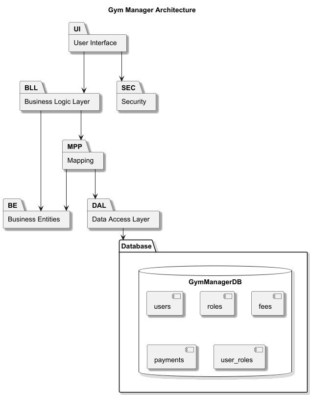
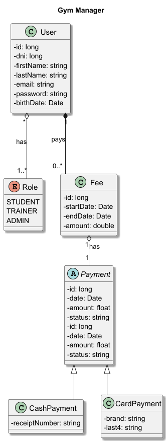

# GymManager

Gestor académico de gimnasio con **aplicación de escritorio (WinForms)**. Implementa un stack en capas con **Entidades (BE)**, **Servicios (BLL)**, **Mappers (MPP)**, **Acceso a Datos (DAL)** contra **SQL Server**, utilidades de **seguridad (SEC)** y un **módulo de documentación** con diagramas.

---

## Índice

- [Arquitectura (capas y proyectos)](#arquitectura-capas-y-proyectos)
- [Requisitos](#requisitos)
- [Base de datos (crear esquema y datos)](#base-de-datos-crear-esquema-y-datos)
- [Variables de entorno](#variables-de-entorno)
- [Arranque rápido](#arranque-rápido)
- [Ejecución por proyecto](#ejecución-por-proyecto)
- [Endpoints de la API](#endpoints-de-la-api)
- [Imágenes y diagramas](#imágenes-y-diagramas)
- [Estructura del repositorio](#estructura-del-repositorio)
- [Notas y troubleshooting](#notas-y-troubleshooting)
- [Licencia](#licencia)

---

## Arquitectura (capas y proyectos)

**Capas principales**

- **BE (Entities):** modelos de dominio puros: `User`, `Payment`, `Fee`, `UserRole`, etc.  
  Proyecto: `GymManager-BE`
- **DAL (Data Access):** conexión SQL Server vía `Microsoft.Data.SqlClient`, levantando el **connection string** desde la variable `GYM_DB_CONNECTION`.  
  Proyecto: `GymManager-DAL` — clase clave: `DataAccess`
- **MPP (Mappers):** CRUD “manual” con SQL para mapear entidades a la base (p. ej. `UserMapper`, `PaymentMapper`).  
  Proyecto: `GymManager-MPP`
- **BLL (Business Logic):** servicios de negocio (p. ej. `UserService`, `PaymentService`) que orquestan mappers, validaciones y reglas.  
  Proyecto: `GymManager-BLL`
- **SEC (Security):** utilidades de cifrado simétrico (`EncryptionUtils`) usadas por la UI.  
  Proyecto: `GymManager-SEC`
- **UI (Escritorio):** **WinForms** (.NET 8) con pantalla de login y formularios para usuarios/cuotas/pagos.  
  Proyecto: `GymManager-UI`
- **Docs:** diagramas (arquitectura y clases) y script SQL del esquema.  
  Proyecto: `GymManager-docs`

---

## Requisitos

- **.NET SDK 8.0**
- **SQL Server** local o en contenedor Docker
- (Opcional) **Visual Studio 2022** / **Rider** / **VS Code** con extensiones C#
- Acceso a **puerto 1433**

**SQL Server en Docker (opcional):**
```bash
docker run -e "ACCEPT_EULA=Y" \
  -e "MSSQL_SA_PASSWORD=Passw0rd#2025" \
  -p 1433:1433 --name sqlserver \
  -d mcr.microsoft.com/mssql/server:2022-latest
```

---

## Base de datos (crear esquema y datos)

El esquema se encuentra en:
```
GymManager-docs/schema.sql
```

Ejecutar contra la instancia de SQL Server (SSMS / Azure Data Studio / sqlcmd). Crea tablas: `users`, `fees`, `payments`, `roles`, `user_roles`.

> **Importante:** El script asume base y esquema `GymManager.dbo`. Si se usa otra DB, ajustar el `schema.sql` o crear previamente la DB `GymManager`.

---

## Variables de entorno

La aplicación (API y UI) necesita **una sola** variable crítica:

| Variable             | Descripción                                   | Ejemplo                                                                                 |
|----------------------|-----------------------------------------------|-----------------------------------------------------------------------------------------|
| `GYM_DB_CONNECTION`  | Connection string de SQL Server               | `Server=localhost,1433;Database=GymManager;User Id=sa;Password=Passw0rd#2025;TrustServerCertificate=True;` |

**Cómo setearla**

- **PowerShell**
  ```powershell
  $env:GYM_DB_CONNECTION="Server=localhost,1433;Database=GymManager;User Id=sa;Password=Passw0rd#2025;TrustServerCertificate=True;"
  ```
- **bash/zsh**
  ```bash
  export GYM_DB_CONNECTION="Server=localhost,1433;Database=GymManager;User Id=sa;Password=Passw0rd#2025;TrustServerCertificate=True;"
  ```

> `TrustServerCertificate=True;` simplifica el arranque local.

---

## Arranque rápido

1) **Levantar SQL Server** (local o Docker) y ejecutar `GymManager-docs/schema.sql`.
2) **Exportar** `GYM_DB_CONNECTION` como se indica arriba.
3) **Restaurar y compilar solución**:
   ```bash
   dotnet restore
   dotnet build -c Debug
   ```
4) **Levantar la UI (WinForms)**:
   ```bash
   dotnet run --project GymManager-UI
   ```

## Imágenes y diagramas

- **Arquitectura (alto nivel)**  
  

- **Diagrama de clases (dominio)**  
  

> Los fuentes de los diagramas están en `GymManager-docs/*.puml`.

---

## Estructura del repositorio

```
GymManager/
├─ GymManager.sln
├─ GymManager-BE/               # Entidades de dominio (User, Payment, Fee, UserRole, etc.)
├─ GymManager-BLL/              # Servicios de negocio (UserService, PaymentService, etc.)
├─ GymManager-DAL/              # Conexión SQL Server via GYM_DB_CONNECTION (DataAccess)
├─ GymManager-MPP/              # Mappers CRUD SQL "manuales"
├─ GymManager-SEC/              # Utilidades de cifrado (EncryptionUtils)
├─ GymManager-UI/               # WinForms (login, ABMs)
└─ GymManager-docs/             # Diagramas (.puml, .png) y schema.sql
```

---
